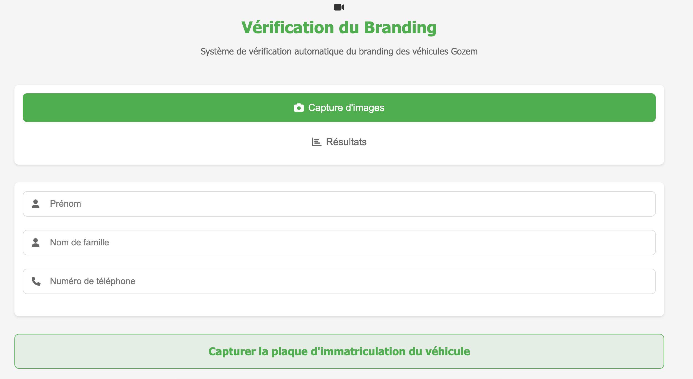

# Branding Web App

Ce projet est une application web pour la vérification automatique du branding des véhicules Gozem.

## Fonctionnalités principales
- Capture d'images de la plaque d'immatriculation et du logo du véhicule
- Détection et affichage des résultats
- Interface utilisateur moderne et intuitive
- Résumé des informations collectées

## Technologies utilisées
- HTML, CSS, JavaScript
- Font Awesome pour les icônes

## Démarrage rapide
1. Cloner le dépôt
2. Ouvrir `index.html` dans votre navigateur

## Structure du projet
- `index.html` : Page principale de l'application
- `style.css` : Styles personnalisés
- `app.js` : Logique JavaScript
- `Dockerfile` : (optionnel) pour déploiement
- `README.md` : Documentation

## Aperçu

## Auteur
Oscar Houessou
